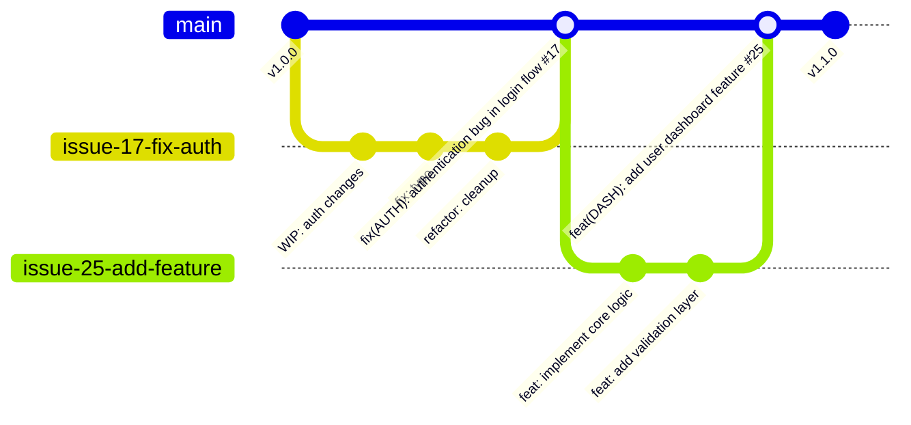

# Contributing Guidelines

We follow a **simplified GitHub Flow** with **rebase and merge** strategy for clean commit history and milestone-driven releases.

## 📋 Quick Start

Here's the complete workflow at a glance:

1. **Create Issue** → Select milestone, use templates, estimate effort
2. **Create Branch** → From main, using GitHub's branch creation feature
3. **Open Draft PR** → Enable early collaboration with reviewers
4. **Develop & Commit** → Frequent commits with descriptive messages
5. **Clean History** → Squash into meaningful commits before requesting review
6. **Request Review** → Convert to ready PR, address feedback
7. **Merge** → Maintainer performs rebase and merge
8. **Auto-Release** → When milestone complete, release-please handles versioning

For detailed instructions, see the sections below:

- [AI Integration Schema](#-ai-integration-schema)
- [Workflow Overview](#workflow-overview)
- [Issue and Milestone Management](#issue-and-milestone-management)
- [Development Process](#development-process)
- [Commit Management](#commit-management)
- [Pull Request Process](#pull-request-process)
- [Branch Management](#branch-management)
- [Release Management](#release-management)
- [Code Standards](#code-standards)

## 🔄 Workflow Overview

Our workflow emphasizes **meaningful commit history** and **milestone-driven releases**:



### Key Principles
- **Meaningful commits on main** - avoid WIP, typo fixes, and noisy commits
- **Rebase and merge only** - no merge commits
- **Milestone-driven releases** - all issues must belong to a milestone
- **Draft PRs for early collaboration** with reviewers
- **Clear PR-Issue linking** - PR titles must include issue number
- **All commits must include issue number** - for complete traceability

## 📊 Issue and Milestone Management

### Creating Issues
All work must begin with a GitHub Issue:

1. **Select milestone first** - Choose from available milestones
2. **Use issue templates** - Choose between:
   - **🐛 Bug Report** - For reporting bugs and issues
   - **✨ Feature Request** - For suggesting new features or improvements
3. **Complete required fields**:
   - **Bug Report**: Description, reproduction steps, expected/actual behavior, severity, version, OS
   - **Feature Request**: Problem statement, proposed solution, priority
4. **Add optional details** as helpful (screenshots, logs, additional context)
5. **Estimate effort** - Use story points (1 point ≈ 2 hours, max 20 points per week)

### Large Feature Management
For complex features, we use **Epic + Sub-issues** approach:

1. **Epic Issue** - Main feature request with overview and background
2. **Team Planning** - Collaborative breakdown into sub-issues (1-2 days each)
3. **Sub-issue Creation** - Each with clear acceptance criteria
4. **Team Assignment** - Developers claim specific sub-issues
5. **Coordinated Development** - All sub-issues tracked in project board

#### Issue Types and Commit Prefixes:
| Issue Type        | Template            | Commit Prefix       | Version Impact   | Example                                                                                 |
| ----------------- | ------------------- | ------------------- | ---------------- | --------------------------------------------------------------------------------------- |
| 🐛 Bug Report      | `🐛 Bug Report`      | `fix:`              | Patch            | `fix(AUTH): resolve payment gateway timeout #142`                                       |
| ✨ Feature Request | `✨ Feature Request` | `feat:` or `feat!:` | Minor or Major** | `feat(DASH): add user profile management #95`<br>`feat!: migrate to new API format #78` |
| Documentation     | Manual creation     | `docs:`             | None*            | `docs(README): update API authentication guide #123`                                    |

*\*Does not trigger version bumps by release-please*

*\*\*Feature Requests can result in either regular features (`feat:` → minor bump) or breaking changes (`feat!:` → major bump) depending on implementation impact*

### Milestone Management
- **All issues must have a milestone** assigned before starting work
- **Milestones represent development cycles** - e.g., "Sprint 7 - Payment Integration"
- **Version numbers determined by release-please** based on commit types
- **Release when milestone complete** - all issues closed

## 🚀 Development Process

### 1. Create Issue Branch
1. Navigate to your assigned GitHub Issue
2. Click "Create a branch for this issue"
3. **Source**: Always branch from `main`
4. **Naming**: GitHub auto-generates (e.g., `17-fix-payment-gateway`)

### 2. Start with Draft PR (Recommended)
Create a **Draft PR** immediately for early collaboration:

```bash
# After first commit
git push -u origin <branch-name>
# Create Draft PR on GitHub
```

**Benefits of Draft PRs:**
- Early feedback from CODEOWNERS reviewers
- Discuss approach before implementation
- Avoid large changes at review time
- Track progress transparently

### 3. Keep Branch Updated
GitHub will **always suggest updating pull request branches**. This complements our rebase and merge strategy:

- When your feature branch falls behind `main`, click **"Update branch"**
- **Always choose "Update with rebase"** to maintain linear history

### 4. Development and Commits
During development, commit frequently with any messages you find helpful:

```bash
# Examples of work-in-progress commits (these will be cleaned up later)
git commit -m "WIP: initial authentication setup"
git commit -m "add password validation logic"
git commit -m "fix: handle edge case for empty passwords"
git commit -m "refactor: extract validation functions"
git commit -m "docs: add authentication flow diagram"
git commit -m "fix typo in error message"
git commit -m "debug: add logging for troubleshooting"
```

**Development Phase Freedom:**
- Commit as frequently as you want with any message style
- Use WIP, debug, typo fix, or any other commit messages
- Focus on progress, not commit message perfection
- These commits will be cleaned up before review

## 📝 Commit Management

### Before Requesting Review (Critical Step)

**You MUST clean up your commit history** before creating a PR or converting Draft PR to ready for review.

#### Option 1: Command Line (Traditional)
```bash
# First, sync with latest main
git fetch origin
git rebase origin/main

# Clean up commits using interactive rebase
git rebase -i origin/main
```

#### Option 2: Visual Studio Code Git Graph (Recommended)
For developers using VS Code, the **Git Graph extension** provides a more intuitive UI approach:

1. **Install Git Graph extension** (if not already installed)
2. **Open Git Graph** - Click the graph icon in Source Control panel
3. **Reset to clean point**:
   - Right-click on the latest `main` commit
   - Select "Reset current branch to this Commit"
   - Choose "**Soft - Keep all changes, but reset head**"
   - This preserves all your work but removes commit history
4. **Create meaningful commits**:
   - Stage and commit your changes as clean, meaningful commits
   - Follow the commit format: `<type>(<scope>): <description> #<issue-number>`
5. **Force push safely**:
   - Right-click on your branch in Git Graph
   - Select "**Push branch - Force With Lease**"
   - This safely updates your remote branch

**Benefits of Git Graph approach:**
- Visual representation of commit history
- Point-and-click interface for complex git operations
- Safer force-push with built-in conflict detection
- No need to remember git rebase commands

### Commit Cleanup Guidelines

**Goal**: Transform messy development commits into **1-n meaningful commits** (typically 1 per issue).

**What to squash/remove:**
- ❌ WIP commits
- ❌ Typo fixes
- ❌ Debug commits
- ❌ "Fix review comments"
- ❌ Any noisy, non-meaningful commits

**What constitutes meaningful commits:**
- ✅ `feat(AUTH): implement user authentication system #17`
- ✅ `fix(PAY): resolve payment gateway timeout issues #142`
- ✅ `refactor(DB): optimize database query performance #201`
- ✅ `docs(API): add API authentication guide #78`

### Interactive Rebase Example
```bash
# Before cleanup (messy development history):
pick abc1234 WIP: start auth work
pick def5678 add validation
pick ghi9012 fix typo in validation
pick jkl3456 debug: add more logging
pick mno7890 fix: handle edge cases
pick pqr1234 remove debug logging
pick stu5678 final cleanup

# After cleanup (meaningful history):
pick abc1234 feat(AUTH): implement user authentication with validation #17
```

**For Complex Features:**
You may keep multiple meaningful commits if they represent distinct logical units:
```bash
# Acceptable for complex features:
feat(AUTH): implement OAuth2 authentication core #17
feat(AUTH): add user session management #17
docs(AUTH): add authentication flow documentation #17
```

### Final Commit Requirements
Your cleaned commits must follow these requirements:

- **Use conventional commit format**: `<type>(<scope>): <description> #<issue-number>`
- **Must include issue number** - **MANDATORY** for all commits
- **Must be `feat:` or `fix:`** to trigger version updates (unless it's docs/refactor/chore)
- **Include scope** for better categorization (AUTH, DASH, PAY, etc.)
- **Be descriptive and actionable**

#### Good Examples:
```bash
feat(DASH): add user dashboard with activity metrics #95
fix(PAY): resolve payment gateway connection timeout #142
refactor(DB): optimize database query performance for large datasets #201
docs(README): update API authentication guide #78
```

#### Bad Examples:
```bash
WIP: working on dashboard  # ❌ Not meaningful, no issue number
Update code  # ❌ Not descriptive, no issue number
fix typo  # ❌ Noisy commit that should be squashed, no issue number
feat: add dashboard  # ❌ Missing issue number (MANDATORY)
```

## 🔀 Pull Request Process

### Before Creating/Converting PR

**MANDATORY STEPS:**

1. **Clean up your commits** (see Commit Management section above)
2. **Ensure all commits include issue number** - This is now **MANDATORY**
3. **Sync with main branch**:
```bash
git fetch origin
git rebase origin/main
git push --force-with-lease origin <branch-name>
```
4. **Run all tests and linting** locally

### Creating the PR

Use our **PR template** which includes:

**Required Sections:**
- **Checklist** - Code standards, testing, documentation
- **Testing** - How changes were tested, evidence provided
- **Deployment Notes** - Any special deployment considerations
- **Reviewer Notes** - Specific areas for review focus

**Template automatically populated** when creating PR from issue branch.

#### PR Title Format:
```
<type>(<scope>): <description> #<issue-number>
```

**IMPORTANT**: PR title must include the issue number for proper linking and traceability.

**Examples:**
```bash
feat(DASH): add user dashboard with activity metrics #95
fix(PAY): resolve payment gateway connection timeout #142
docs(README): update API authentication guide #78
refactor(DB): optimize database query performance #201
```

### Review Process

1. **CODEOWNERS automatically assigned** as reviewers
2. **Address feedback promptly**:
   ```bash
   # Address review feedback with additional commits
   git commit -m "address review: improve error handling per feedback #95"
   git commit -m "fix(DASH): update tests based on reviewer suggestions #95"
   ```
3. **All CI checks must pass** before merge
4. **At least one approval required** from CODEOWNERS

### Merge Timing and Responsibilities

**Key Understanding:**
- **Reviewers decide when to merge** - once they approve, they typically merge immediately
- **No additional cleanup opportunity** after review approval
- **Reviewers may request commit cleanup** as part of their review if they notice noisy commits
- **Developer responsibility**: Ensure commits are clean BEFORE requesting review

**Review Scenarios:**

**Scenario 1: Clean commits submitted**
```
✅ Developer submits PR with meaningful commits (all with issue numbers)
✅ Reviewer approves and merges immediately
✅ Clean history preserved on main
```

**Scenario 2: Noisy commits detected**
```
❌ Developer submits PR with WIP/typo commits or missing issue numbers
🔍 Reviewer requests: "Please clean up commits and add issue numbers before merge"
🛠️ Developer rebases and force-pushes cleaned history
✅ Reviewer re-approves and merges
```

### Merge Process

- **Only "Rebase and merge" allowed** - other options are disabled
- **Maintainer performs the merge** after approval
- **Commits appear on main exactly as they exist on feature branch**
- **Branch automatically deleted** after merge

## 🌿 Branch Management

### Automatic Branch Deletion
**After pull requests are merged, issue branches are deleted automatically.**

Since we use the **rebase and merge** strategy, issue branches become unnecessary after merge and can be safely deleted. This keeps the repository clean and prevents branch accumulation.

### Recreating Issue Branches for Debugging

Sometimes you may need to recreate an issue branch for debugging or reference purposes. Here's how:

#### Method 1: From Main Branch History
1. **Find the issue commit** in main branch history
2. **Copy the commit SHA** (the unique identifier)
3. **Create new branch** from that commit:
   ```bash
   git checkout -b new-debug-branch <commit-SHA>
   ```

#### Method 2: From PR Page
1. **Navigate to the merged PR page** on GitHub
2. **Click the "Commits" tab** in the PR
3. **Find the commit** you're interested in
4. **Copy the commit SHA** from the commit details
5. **Create new branch** locally:
   ```bash
   git checkout -b new-debug-branch <commit-SHA>
   ```

#### Result
Now you have a new branch with content **exactly matching** the original issue branch at the time of merge. This is perfect for:
- Debugging issues that emerged after merge
- Understanding the implementation details
- Creating hotfixes based on previous work
- Code archaeology and investigation

**Example Workflow:**
```bash
# Find commit SHA from main branch or PR page
git log --oneline | grep "#142"
# Output: abc1234 fix(PAY): resolve payment gateway timeout #142

# Create debug branch from that commit
git checkout -b debug-payment-issue abc1234

# Now you have the exact state of the original issue branch
```

## 🏷️ Release Management

### Understanding Release-Please

**Release-please** is an automated tool that handles versioning and releases by:

1. **Analyzing commit messages** on main branch
2. **Determining version type** based on conventional commits:
   - `feat:` commits → Minor version bump (1.1.0 → 1.2.0)
   - `fix:` commits → Patch version bump (1.1.0 → 1.1.1)
   - `feat!:` or `BREAKING CHANGE` → Major version bump (1.1.0 → 2.0.0)
3. **Generating changelog** from commit messages and linked issues
4. **Creating release PR** with version bump and changelog
5. **Creating Git tags** when release PR is merged

### Milestone Completion
When all issues in a milestone are completed:

1. **Release-please creates release PR** automatically
2. **Maintainer reviews and merges** release PR to main
3. **Automatic version bump and changelog** generation
4. **Git tag created** with version number
5. **CI/CD deployment triggered** automatically

### Version Strategy
Following **semantic versioning** (semver):

- **feat:** commits → Minor version bump (1.1.0 → 1.2.0)
- **fix:** commits → Patch version bump (1.1.0 → 1.1.1)
- **feat!:** or **BREAKING CHANGE** → Major version bump (1.1.0 → 2.0.0)
- **docs/refactor/chore:** → No version bump

## 💡 Code Standards

### Quality Requirements
- **All linting warnings resolved** before review
- **Test coverage ≥ 80%** for new code
- **Unit tests required** for business logic
- **Integration tests required** for APIs

### Naming Conventions
- **Variables**: camelCase (JS/Dart) or snake_case (Python)
- **Functions**: Descriptive verbs (`getUserById`, `calculateTotal`)
- **Classes**: PascalCase (`UserService`, `PaymentGateway`)
- **Files**: kebab-case (`user-service.js`, `payment-gateway.py`)

### Best Practices
- **Functions under 20 lines** (max 50 lines)
- **Single responsibility principle**
- **Maximum 3 levels of nesting**
- **Meaningful comments explain why, not what**
- **Remove dead code** before PR

## 🛠️ Common Git Operations

### Interactive Rebase Example (Command Line)
```bash
# Start interactive rebase (make sure to fetch first)
git fetch origin
git rebase -i origin/main

# In the editor, squash noisy commits:
pick abc1234 feat(AUTH): implement user authentication #17
squash def5678 WIP: add validation
squash ghi9012 fix typo in validation
squash jkl3456 remove debug logging

# Edit the final commit message to be meaningful:
# feat(AUTH): implement user authentication with validation #17
```

### Git Graph Alternative (Visual Studio Code)
For VS Code users, commit cleanup can be done visually:

1. **View commit history** in Git Graph extension
2. **Identify cleanup point** - usually the last commit from main
3. **Soft reset** to that point (keeps all changes)
4. **Re-commit cleanly** with meaningful messages and issue numbers
5. **Force push with lease** to update remote branch

### Handling Review Changes
```bash
# After reviewer approval, they merge immediately
# No opportunity for additional cleanup

# If reviewer requests commit cleanup:
git rebase -i origin/main  # Clean up commits
git push --force-with-lease origin <branch-name>  # Update PR
# Reviewer will then re-review and merge
```

## 🔍 Enhanced Traceability with Issue Linking

With our improved commit format requiring issue numbers, traceability is significantly enhanced:

### Complete Traceability Chain
```
Issue #93 → Branch 93-docs-update → PR #94 "docs(README): update contributing guide #93" → Commit "docs(README): update contributing guide #93"
```

### Finding Related Content
1. **From main branch commit**: Issue number is directly visible in commit message
2. **Click issue number** (e.g., #93) to jump directly to the issue
3. **From commit to PR**: GitHub automatically links commits to their PRs
4. **From PR to issue**: Issue number in PR title links directly to original issue
5. **Reverse lookup**: GitHub automatically shows all PRs that reference an issue

### Benefits of Enhanced Linking
- **Instant issue identification** from any commit on main branch
- **One-click navigation** from commit to issue via #issue-number
- **Streamlined code archaeology** - easily trace why changes were made
- **Automated issue closing** - GitHub closes issues when PR with `#issue-number` is merged
- **Better project management** - clear visibility of which issues are in progress/completed
- **Improved changelog generation** - release notes can include issue context
- **Perfect traceability** - every commit is linked to its originating issue

### Main Branch History Example
```bash
git log --oneline
f2a1b3c feat(DASH): add user activity metrics dashboard #95
e4d5c6f fix(AUTH): resolve OAuth token refresh bug #87
a7b8c9d feat(PAY): implement Stripe payment integration #78
```

From this history, you can:
- **Click #95** to see the original dashboard feature request
- **Click #87** to understand the auth bug context
- **Click #78** to review payment integration requirements
- **Trace complete development lifecycle** for any feature

## 🤔 FAQ

**Q: When exactly should I clean up my commits?**
A: **Before creating a PR or converting Draft PR to ready for review**. This is mandatory - reviewers expect clean, meaningful commits with issue numbers.

**Q: Can I keep WIP commits in my PR?**
A: **No**. All WIP, typo fixes, debug commits, and other noisy commits must be squashed before review. Use interactive rebase to clean them up.

**Q: Do all my commits need to have issue numbers?**
A: **Yes, this is now MANDATORY**. Every commit must include the issue number (e.g., `#123`) for complete traceability. Commits without issue numbers will be rejected.

**Q: What if reviewers ask for changes after I submit clean commits?**
A: Make the requested changes in new commits (still including issue numbers). Reviewers will merge when satisfied - there's typically no opportunity for you to clean up review feedback commits before merge.

**Q: Do I need exactly one commit per PR?**
A: **No**. You need **1-n meaningful commits**. Simple issues typically result in 1 commit, but complex features can have multiple logical commits (e.g., core implementation + documentation + tests).

**Q: What's the easiest way to clean up commits if I'm not comfortable with git rebase?**
A: **Use Visual Studio Code's Git Graph extension**. It provides a visual interface where you can:
1. Right-click on main's latest commit → "Reset current branch to this Commit" → "Soft"
2. This keeps all your changes but cleans the commit history
3. Create new meaningful commits with proper messages and issue numbers
4. Force push with lease to update your branch

This is much more intuitive than interactive rebase for beginners.

**Q: Why is the issue number requirement so important?**
A: Issue numbers create **complete traceability** from commits back to requirements. When someone reads the main branch history, they can instantly understand:
- What problem each commit solves
- Why the change was made
- Who requested the feature
- When it was implemented
- Click directly to the issue for full context

**Q: What's the difference between "squash all into one" vs "meaningful commits"?**
A:
- ❌ **Squash everything**: Forces all work into exactly 1 commit regardless of complexity
- ✅ **Meaningful commits**: Keep logically distinct work separate, remove noise

**Examples:**
```bash
# Complex feature with meaningful commits:
feat(AUTH): implement OAuth2 authentication core #17
feat(AUTH): add session management and user profiles #17
docs(AUTH): add authentication setup guide #17

# Simple bug fix:
fix(PAY): resolve payment gateway timeout issue #142
```

**Q: My issue branch was deleted after merge - how do I continue working on related issues?**
A: This is normal behavior. For new work:
1. **Create a new issue** for the additional work
2. **Branch from main** (which now includes your previous work)
3. **Follow the standard workflow** with the new issue number

If you need to reference the old branch state, use the **branch recreation method** described in the Branch Management section.

**Q: Can I work on multiple issues simultaneously?**
A: Yes, but each must have its own branch and milestone assignment. Remember that each commit must reference its specific issue number.

**Q: What happens if CI fails after merge?**
A: Create a hotfix issue and follow the same process. No direct commits to main allowed.

**Q: How do I handle breaking changes?**
A: Use the exclamation mark syntax in your commit type to trigger a major version bump:

```bash
# Breaking change examples:
feat!(AUTH): change user ID from int to UUID #123

# Or with detailed explanation:
feat!(API): migrate authentication to OAuth 2.0 #456

BREAKING CHANGE: Previous API key authentication is no longer supported.
Users must migrate to OAuth 2.0 authentication flow.
```

**Q: How do we handle large features?**
A: Use Epic + Sub-issues approach. Team collaboratively breaks down the epic into 1-2 day sub-issues, each developer claims specific sub-issues and creates their own branch + PR. Each sub-issue gets its own commits with the corresponding issue number.

**Q: What about hotfixes for production issues?**
A: We don't use hotfix branches. All changes follow the standard workflow. Production issues are handled at the deployment level using CI/CD rollback capabilities.

**Q: Why should I use `git rebase -i origin/main` instead of `git rebase -i main`?**
A: Using `origin/main` ensures you're rebasing against the latest remote version of main, and it only affects commits unique to your feature branch.

**Q: What if I forget to add the issue number to a commit?**
A: You must fix this before review. Use interactive rebase to amend the commit message and include the issue number. Commits without issue numbers will be rejected during review.

## 🤖 AI Integration Schema

To support AI-powered development tools, here are the machine-readable format standards:

### Commit Format Schema
```yaml
commit:
  format: "<type>(<scope>): <description> #<issue>"
  mandatory_fields:
    - type: Required commit type
    - scope: Component/area affected
    - description: Clear, actionable description
    - issue: GitHub issue number (MANDATORY)
  types:
    - feat      # New features (minor version bump)
    - fix       # Bug fixes (patch version bump)
    - docs      # Documentation changes (no version bump)
    - refactor  # Code refactoring (no version bump)
    - chore     # Maintenance tasks (no version bump)
  breaking_change:
    format: "<type>!(<scope>): <description> #<issue>"
    description: "Use exclamation mark for major version bumps"
  cleanup_required: true
  cleanup_timing: "Before creating PR or converting Draft to ready"
  examples:
    - "feat(DASH): add user dashboard with activity metrics #95"
    - "fix(PAY): resolve payment gateway timeout issues #142"
    - "feat!(AUTH): migrate to OAuth 2.0 authentication #78"
```

### PR Title Schema
```yaml
pr_title:
  regex: "^(feat|fix|docs|refactor|chore)(!)?\\(\\w+\\):\\s.+\\s#[0-9]+$"
  format: "<type>(<scope>): <description> #<issue-number>"
  required_fields:
    - type: Must match commit types
    - scope: Component/area affected
    - description: Clear, actionable description
    - issue_number: GitHub issue reference (MANDATORY)
  examples:
    - "feat(DASH): add user dashboard with activity metrics #95"
    - "fix(PAY): resolve payment gateway connection timeout #142"
```

### Commit Cleanup Schema
```yaml
commit_cleanup:
  timing: "Before PR creation or Draft conversion to ready"
  mandatory: true
  goal: "1-n meaningful commits per issue"
  requirements:
    - "All commits must include issue number"
    - "Use conventional commit format with scope"
    - "Descriptive and actionable commit messages"
  remove_commits:
    - "WIP commits"
    - "Typo fixes"
    - "Debug commits"
    - "Temporary commits"
  keep_commits:
    - "Logical feature implementations"
    - "Distinct bug fixes"
    - "Documentation additions"
    - "Refactoring improvements"
  tools:
    - "git rebase -i origin/main"
    - "Interactive rebase for squashing"
```

### Branch Management Schema
```yaml
branch_management:
  auto_deletion: true
  deletion_timing: "After PR merge"
  reason: "Rebase and merge strategy makes branches unnecessary"
  recreation_methods:
    - method: "From main branch history"
      steps:
        - "Find issue commit in main branch"
        - "Copy commit SHA"
        - "git checkout -b new-debug-branch <commit-SHA>"
    - method: "From PR page"
      steps:
        - "Navigate to merged PR"
        - "Click Commits tab"
        - "Copy commit SHA"
        - "git checkout -b new-debug-branch <commit-SHA>"
  use_cases:
    - "Debugging post-merge issues"
    - "Code archaeology"
    - "Understanding implementation details"
    - "Creating related hotfixes"
```

### PR Description Schema
```yaml
pr_description:
  required_sections:
    - checklist:
        - "Code follows project style guidelines"
        - "Self-review completed"
        - "Tests added/updated and passing"
        - "Documentation updated"
        - "Commits cleaned up and meaningful"
        - "All commits include issue numbers"
    - testing:
        description: "How changes were tested with evidence"
        required: true
    - deployment_notes:
        description: "Special deployment considerations"
        required: false
    - reviewer_notes:
        description: "Specific areas for review focus"
        required: false
  template_auto_populated: true
  branch_update_strategy: "Always suggest rebase updates"
```

### Issue Schema
```yaml
issue:
  required_fields:
    - milestone: "Must be assigned before starting work"
    - template: "🐛 Bug Report or ✨ Feature Request"
    - estimation: "Story points (1 point ≈ 2 hours, max 20 points/week)"
  templates:
    bug_report:
      name: "🐛 Bug Report"
      labels: ["type: bug", "needs-triage"]
      required_fields:
        - description: "Clear bug description"
        - reproduction: "Steps to reproduce"
        - expected: "Expected behavior"
        - actual: "Actual behavior"
        - severity: "Low/Medium/High/Critical"
        - version: "Software version"
        - os: "Operating system"
      optional_fields:
        - browser: "Browser (if applicable)"
        - logs: "Error messages/logs"
        - screenshots: "Visual evidence"
        - additional: "Additional context"
      commit_type: "fix"
      version_impact: "patch"
    feature_request:
      name: "✨ Feature Request"
      labels: ["type: feature", "needs-triage"]
      required_fields:
        - problem: "Problem statement"
        - solution: "Proposed solution with acceptance criteria"
        - priority: "Low/Medium/High/Critical"
      optional_fields:
        - additional: "Additional context, mockups, examples"
      commit_type: "feat or feat!"
      version_impact: "minor or major (depending on breaking changes)"
```

---

**Remember**: Clean, meaningful commits with issue numbers before review - this is your only opportunity to ensure main branch history stays clean and traceable! 🧹✨🔗